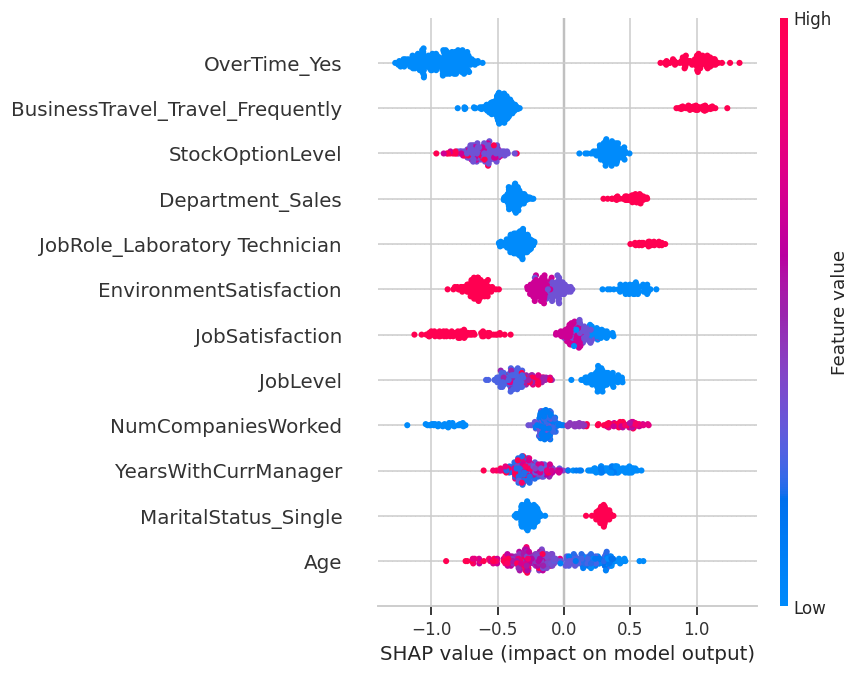

# 🔮 Dự Đoán & Cảnh Báo Sớm Nghỉ Việc Nhân Sự

Hệ thống Machine Learning dự đoán nguy cơ nghỉ việc của nhân viên, giúp bộ phận HR can
thiệp giữ chân nhân tài sớm thay vì bị động — xây dựng theo lộ trình 4 ngày full-time,
từ EDA đến mô hình đã tune, giải thích được (SHAP), và dashboard demo được.

🔗 **Demo trực tiếp:** _(dán link Streamlit Community Cloud sau khi deploy — xem hướng dẫn bên dưới)_

## 📌 Bài toán

Chi phí thay thế một nhân viên thường được ước tính trong khoảng 50–200% lương năm của vị
trí đó (tuyển dụng, đào tạo lại, năng suất sụt giảm, mất tri thức ngầm). Dự án này xây một
mô hình dự đoán **trước** ai có khả năng nghỉ việc cao, thay vì chỉ phân tích nguyên nhân
**sau khi** họ đã rời đi — để HR có thể hành động sớm và cá nhân hoá.

## 📊 Dataset

[IBM HR Analytics Employee Attrition & Performance](https://www.kaggle.com/datasets/pavansubhasht/ibm-hr-analytics-attrition-dataset)
— 1.470 nhân viên, 35 thuộc tính, dữ liệu tổng hợp (synthetic) do IBM phát hành. Biến mục
tiêu `Attrition` mất cân bằng: 83.9% No / 16.1% Yes.

## 🧪 Phương pháp

1. **EDA + tiền xử lý:** loại cột vô nghĩa, One-Hot Encoding, StandardScaler
2. **Stratified Train/Test Split** (80/20) — bảo toàn tỷ lệ lớp
3. **SMOTE** xử lý mất cân bằng — chỉ áp dụng trên tập train, đóng gói trong
   `imblearn.Pipeline` để tránh rò rỉ dữ liệu giữa các fold khi cross-validate
4. **So sánh 5 mô hình:** Logistic Regression, Random Forest, XGBoost, LightGBM, CatBoost
   (Stratified 5-Fold CV)
5. **Tune sâu** 2 ứng viên tốt nhất bằng `RandomizedSearchCV` (tối ưu theo PR-AUC)
6. **Threshold Tuning** theo chi phí kinh doanh — ưu tiên Recall ≥ 0.80 vì bỏ sót một
   nhân sự sắp nghỉ (False Negative) tốn kém hơn nhiều so với báo động nhầm (False Positive)
7. **Explainable AI** với SHAP (TreeExplainer) — beeswarm (global) + waterfall (local)

## 📈 Kết quả

| Mô hình | Ngưỡng | Precision | Recall | F1 | PR-AUC | ROC-AUC |
|---|---|---|---|---|---|---|
| Logistic Regression (baseline) | 0.50 | 0.56 | 0.49 | 0.52 | – | – |
| Logistic Regression (đã tune) | 0.50 | 0.356 | 0.681 | 0.467 | 0.568 | 0.786 |
| CatBoost (đã tune) | 0.50 | 0.778 | 0.298 | 0.431 | 0.572 | 0.801 |
| **CatBoost (đã tune) — MÔ HÌNH CUỐI** | **0.092** | **0.342** | **0.809** | **0.481** | **0.572** | **0.801** |

CatBoost thắng về PR-AUC/ROC-AUC (thước đo không phụ thuộc ngưỡng). Ở ngưỡng mặc định 0.5
nó có Precision rất cao nhưng Recall quá thấp (chỉ bắt được 30% người sắp nghỉ) — sau khi
hạ ngưỡng xuống 0.092 theo đúng yêu cầu kinh doanh, mô hình bắt được **81%** người sắp nghỉ
việc, đánh đổi bằng việc chấp nhận báo động nhầm nhiều hơn (Precision 34%).

**Trên tập test (294 người):** bắt đúng 38/47 người sắp nghỉ thật (bỏ sót 9), báo nhầm
73/247 người không có ý định nghỉ.

## 🔑 Insight chính (SHAP)

`OverTime` (làm thêm giờ) là yếu tố ảnh hưởng mạnh nhất đến rủi ro nghỉ việc — bỏ xa các
yếu tố còn lại. Theo sau là `BusinessTravel` (đi công tác thường xuyên) và `StockOptionLevel`
thấp. Hai nhóm có rủi ro nội tại cao hơn hẳn: phòng **Sales** và vị trí **Laboratory
Technician**. Đáng chú ý: `MonthlyIncome` — dù tương quan thô khá cao — lại **không** nằm
trong top 10 yếu tố SHAP quan trọng nhất, cho thấy đãi ngộ tài chính không phải đòn bẩy
mạnh nhất; chính sách làm thêm giờ và cường độ công tác mới là nơi HR nên ưu tiên rà soát.



## 🖥️ Dashboard demo

Dự án có **2 phiên bản dashboard** (cùng logic, khác nền tảng) để demo:

| | Streamlit | Gradio |
|---|---|---|
| File | `app/app.py` | `app/gradio_app.py` |
| Chạy local | `streamlit run app/app.py` | `python app/gradio_app.py` |
| Deploy free | Streamlit Community Cloud | Hugging Face Spaces |
| Phù hợp khi | dashboard nội bộ, nhiều panel | demo model chia sẻ nhanh, hệ sinh thái AI/HuggingFace |

Cả 2 đều hỗ trợ: **Tải CSV hàng loạt** (định dạng gốc như file Kaggle) → chấm điểm rủi ro
toàn bộ danh sách, và **Nhập tay 1 nhân viên** → dự đoán tức thì + giải thích SHAP riêng.

### Deploy Gradio lên Hugging Face Spaces (free)

1. Tạo tài khoản tại huggingface.co → **New Space** → chọn SDK = **Gradio**
2. Trong Space mới, tải lên: `app/gradio_app.py` (đổi tên thành `app.py`), toàn bộ thư mục
   `models/`, và `requirements.txt`
3. Sửa dòng cuối `gradio_app.py` nếu cần: Spaces tự chạy file `app.py`, không cần gọi `demo.launch()`
   thủ công (Spaces tự nhận biến `demo`)
4. Space build xong sẽ có link dạng `https://huggingface.co/spaces/<username>/<space-name>` — dán vào đầu README

## 🚀 Cách chạy dự án

```bash
git clone https://github.com/<username>/employee-attrition-prediction.git
cd employee-attrition-prediction
pip install -r requirements.txt

# Mở các notebook theo thứ tự 01 -> 04 (thư mục notebooks/), hoặc chạy thẳng dashboard:
streamlit run app/app.py        # bản Streamlit
python app/gradio_app.py        # bản Gradio (http://localhost:7860)
```

## 📁 Cấu trúc thư mục

```
employee-attrition-prediction/
├── data/
│   ├── raw/                          # dataset gốc từ Kaggle
│   └── processed/                    # dữ liệu đã encode, kết quả so sánh mô hình, risk segmentation
├── notebooks/
│   ├── 01_eda_preprocessing.ipynb
│   ├── 02_split_smote_baseline.ipynb
│   ├── 03_tuning_evaluation_threshold.ipynb
│   └── 04_shap_explainability.ipynb
├── models/                           # scaler, model cuối, threshold, schema cho app
├── images/                           # toàn bộ biểu đồ (EDA, SHAP, evaluation)
├── app/
│   ├── app.py                        # Streamlit dashboard
│   └── gradio_app.py                 # Gradio dashboard (deploy free lên HuggingFace Spaces)
├── requirements.txt
└── README.md
```

## 🛠️ Tech Stack

Python · pandas · scikit-learn · imbalanced-learn · CatBoost/XGBoost/LightGBM · SHAP · Streamlit · Gradio

## 👤 Tác giả

_[Tên bạn]_ — _[LinkedIn/GitHub của bạn]_
