# Dự Đoán & Cảnh Báo Sớm Nghỉ Việc Nhân Sự

Hệ thống Machine Learning dự đoán nguy cơ nghỉ việc của nhân viên, giúp bộ phận HR can
thiệp giữ chân nhân tài sớm thay vì bị động — xây dựng theo lộ trình 4 ngày full-time,
từ EDA đến mô hình đã tune, giải thích được (SHAP), và dashboard demo được.

**Demo trực tiếp:** _(dán link Streamlit Community Cloud sau khi deploy — xem hướng dẫn bên dưới)_

## Mục lục

- [Bài toán](#bài-toán)
- [Dataset](#dataset)
- [Phương pháp](#phương-pháp)
- [Kết quả](#kết-quả)
- [Insight chính (SHAP)](#insight-chính-shap)
- [Phân tích chuyên sâu](#phân-tích-chuyên-sâu)
- [Dashboard demo](#dashboard-demo)
- [Cách chạy dự án](#cách-chạy-dự-án)
- [Cấu trúc thư mục](#cấu-trúc-thư-mục)
- [Lỗi thật gặp phải trong lúc làm](#lỗi-thật-gặp-phải-trong-lúc-làm)
- [Nếu làm lại, mình sẽ cải thiện thêm](#nếu-làm-lại-mình-sẽ-cải-thiện-thêm)
- [Tech Stack](#tech-stack)
- [Tác giả](#tác-giả)

## Bài toán

Chi phí thay thế một nhân viên thường được ước tính trong khoảng 50–200% lương năm của vị
trí đó (tuyển dụng, đào tạo lại, năng suất sụt giảm, mất tri thức ngầm). Dự án này xây một
mô hình dự đoán **trước** ai có khả năng nghỉ việc cao, thay vì chỉ phân tích nguyên nhân
**sau khi** họ đã rời đi — để HR có thể hành động sớm và cá nhân hoá.

## Dataset

[IBM HR Analytics Employee Attrition & Performance](https://www.kaggle.com/datasets/pavansubhasht/ibm-hr-analytics-attrition-dataset)
— 1.470 nhân viên, 35 thuộc tính, dữ liệu tổng hợp (synthetic) do IBM phát hành. Biến mục
tiêu `Attrition` mất cân bằng: 83.9% No / 16.1% Yes.

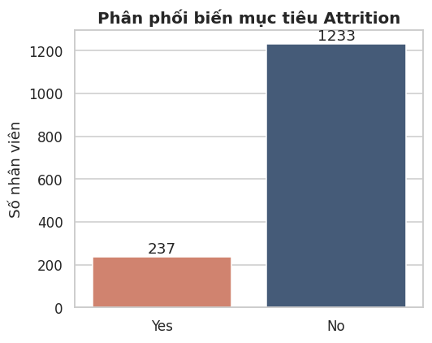
*1.233 người ở lại so với 237 người nghỉ việc — ngay từ đây đã thấy vì sao Accuracy đơn
thuần sẽ đánh lừa: một mô hình "đoán bừa toàn No" vẫn đạt 83.9% Accuracy mà vô dụng hoàn toàn.*

6 biến được khảo sát đầu tiên vì được nhắc tới nhiều trong tài liệu tham khảo của bài toán
này — `OverTime`, `MonthlyIncome`, `JobSatisfaction`, `YearsAtCompany`, `Age`, `DistanceFromHome`:

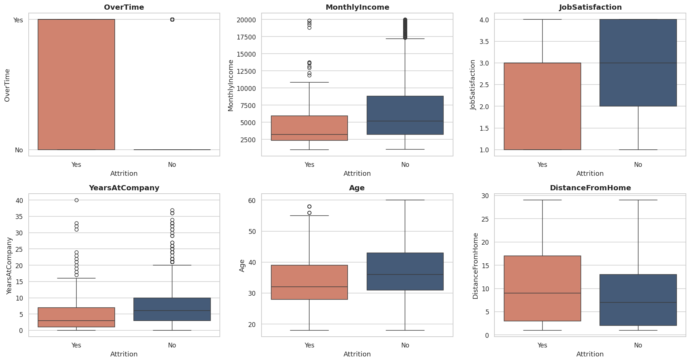
*So sánh phân phối từng biến giữa nhóm nghỉ việc (Yes) và ở lại (No).*

**Quan sát nhanh:**
- `OverTime = Yes` → tỷ lệ nghỉ việc cao hơn hẳn so với `OverTime = No`.
- `MonthlyIncome` của nhóm nghỉ việc có xu hướng thấp hơn nhóm ở lại.
- `JobSatisfaction` thấp (1-2) xuất hiện nhiều hơn ở nhóm nghỉ việc.
- Nhân viên trẻ tuổi và mới vào công ty có xu hướng nghỉ việc nhiều hơn.

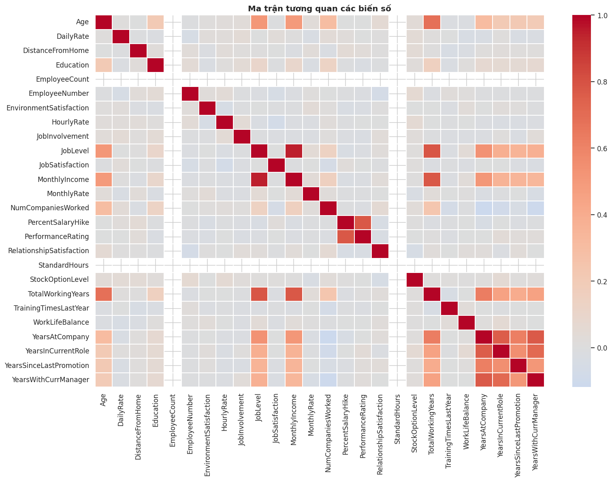
*Một số biến số tương quan khá cao với nhau (JobLevel, MonthlyIncome, TotalWorkingYears,
YearsAtCompany) — lý do cần cẩn trọng khi đọc tương quan đơn lẻ của 1 biến. Đây cũng là một
phần lý do tương quan thô và SHAP (đa biến, ở phần Insight bên dưới) kể 2 câu chuyện khác
nhau về `MonthlyIncome`.*

## Phương pháp

Mỗi lựa chọn kỹ thuật dưới đây đều có lý do cụ thể — phần lớn được kiểm chứng lại bằng số
liệu thật thay vì chỉ dựa vào lý thuyết suông.

### 1. EDA và tiền xử lý

Loại 4 cột vô nghĩa (chỉ có 1 giá trị duy nhất trên toàn dataset, hoặc là ID không mang
thông tin dự đoán), sau đó One-Hot Encoding (`drop_first=True` để tránh đa cộng tuyến).
Biến mục tiêu `Attrition` được mã hoá riêng thành 0/1.

**Vì sao chưa chuẩn hoá (StandardScaler) ngay ở bước này:** `scaler.fit()` tính mean/std
trên đúng dữ liệu được đưa vào — nếu fit trước khi chia train/test, thống kê của tập test sẽ
len vào quá trình huấn luyện. Đây là một dạng rò rỉ dữ liệu tinh vi, không gây lỗi chạy code
nên rất dễ bỏ sót, chỉ âm thầm khiến số liệu đánh giá lạc quan giả tạo. Bước chuẩn hoá vì vậy
được dời sang đầu Ngày 2, ngay sau khi split.

### 2. Stratified Train/Test Split (80/20)

`stratify=y` để tỷ lệ Yes/No được giữ nguyên ở cả 2 tập — nếu chia ngẫu nhiên thuần tuý, tập
test nhỏ (294 người) có thể vô tình lệch tỷ lệ nghỉ việc khá xa so với thực tế.

### 3. Chuẩn hoá dữ liệu số (StandardScaler, chỉ fit trên Train)

Quy tắc vàng chống rò rỉ: `fit_transform()` chỉ gọi trên `X_train`; với `X_test` chỉ gọi
`transform()`, dùng lại đúng mean/std đã học từ train.

### 4. SMOTE xử lý mất cân bằng

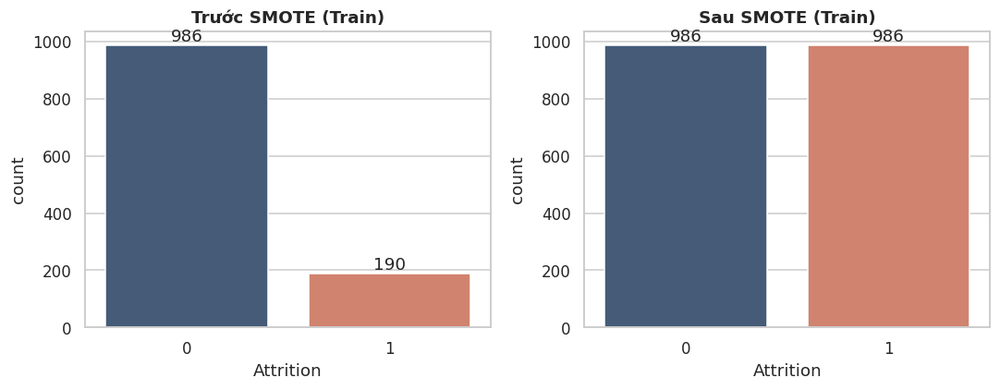
*986 người ở lại vs chỉ 190 người nghỉ trong tập train (80%) trước SMOTE; sau SMOTE cân bằng
986/986 bằng mẫu tổng hợp nội suy k-nearest-neighbors từ lớp thiểu số.*

**Vì sao đóng gói SMOTE trong `imblearn.Pipeline`** thay vì chạy SMOTE 1 lần rồi tái sử dụng
kết quả cho mọi mô hình: đây chính là bài học từ lỗi thật gặp phải ở Ngày 2 (chi tiết ở mục
["Lỗi thật gặp phải"](#lỗi-thật-gặp-phải-trong-lúc-làm) bên dưới) — SMOTE chạy trước khi vào
cross-validation khiến các fold không còn độc lập. Đóng gói trong Pipeline đảm bảo SMOTE luôn
chạy lại **bên trong** phần train của từng fold, và tự động bị bỏ qua lúc `.predict()`.

### 5. So sánh 5 mô hình (Stratified 5-Fold CV, tham số mặc định)

**Vì sao so sánh nhanh bằng tham số mặc định trước khi tune sâu:** `RandomizedSearchCV` tốn
thời gian tính toán đáng kể cho mỗi mô hình. So sánh nhanh giúp thu hẹp từ 5 xuống còn 2 ứng
viên đáng để đầu tư thời gian tune sâu, thay vì tune mù cả 5 mô hình.

| Mô hình | Recall | Precision | F1 | PR-AUC |
|---|---|---|---|---|
| **CatBoost** | 0.39 | 0.76 | 0.52 | **0.63** |
| Random Forest | 0.34 | 0.75 | 0.46 | 0.59 |
| Logistic Regression | 0.49 | 0.60 | 0.54 | 0.59 |
| LightGBM | 0.37 | 0.68 | 0.47 | 0.58 |
| XGBoost | 0.35 | 0.64 | 0.45 | 0.57 |

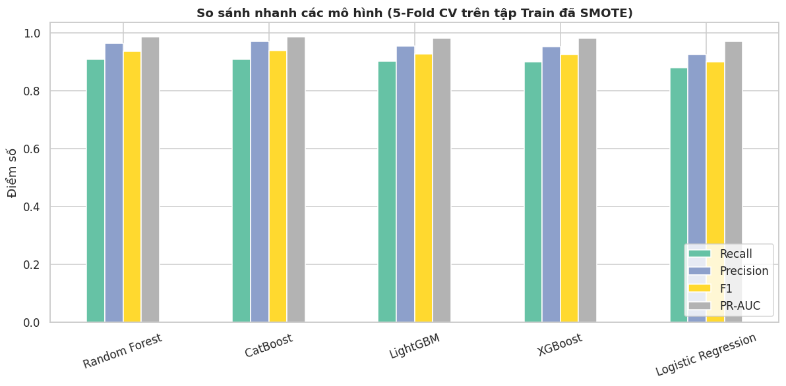
*5-Fold CV, SMOTE chạy lại đúng chuẩn trong từng fold — CatBoost dẫn đầu PR-AUC và Precision,
Logistic Regression dẫn đầu Recall.*

**Vì sao chọn CatBoost và Logistic Regression làm 2 ứng viên tune sâu:** CatBoost dẫn đầu
PR-AUC — thước đo tổng hợp không phụ thuộc ngưỡng — và có Precision cao nhất. Logistic
Regression có Recall mặc định cao nhất, lại là một baseline tuyến tính, diễn giải được, huấn
luyện nhanh. Hai mô hình đại diện cho 2 trường phái khác hẳn nhau (tuyến tính đơn giản vs
gradient boosting phi tuyến) — giữ cả 2 để tune sâu, tránh bỏ sót trường hợp một trong hai
bứt phá rõ rệt sau khi tune, thay vì chỉ tune mỗi ứng viên dẫn đầu CV mặc định.

### 6. Tune sâu bằng RandomizedSearchCV (tối ưu theo PR-AUC)

**Vì sao chọn PR-AUC làm tiêu chí tune** (`scoring='average_precision'`) thay vì Accuracy hay
F1 tại 1 ngưỡng cố định: PR-AUC phản ánh chất lượng mô hình trên **mọi** ngưỡng quyết định
cùng lúc, tách biệt hoàn toàn với bước chọn ngưỡng cụ thể (làm riêng ở bước 7). Gộp 2 câu hỏi
này làm một — "mô hình nào tốt hơn" và "ngưỡng nào phù hợp bài toán kinh doanh" — rất dễ dẫn
đến kết luận sai.

| Mô hình (đã tune) | Precision | Recall | F1 | PR-AUC | ROC-AUC |
|---|---|---|---|---|---|
| Logistic Regression | 0.356 | 0.681 | 0.467 | 0.568 | 0.786 |
| **CatBoost** | 0.778 | 0.298 | 0.431 | **0.572** | **0.801** |

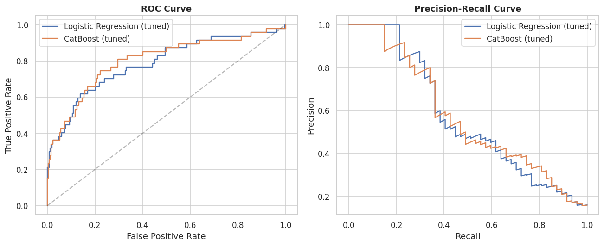
*2 ứng viên sau khi tune sâu — CatBoost nhỉnh hơn trên cả ROC-AUC (0.801 vs 0.786) và PR-AUC
(0.572 vs 0.568), dù Recall ở ngưỡng mặc định 0.5 thấp hơn hẳn LogReg.*

**Vì sao CatBoost thắng dù Recall ở ngưỡng mặc định thấp hơn hẳn (0.298 vs 0.681):** đây
chính xác là lý do PR-AUC/ROC-AUC được chọn làm tiêu chí — hai thước đo này nhìn toàn bộ dải
ngưỡng chứ không riêng ngưỡng 0.5. CatBoost có nhiều dư địa hơn để đạt Recall cao mà không hi
sinh Precision quá nhiều một khi ngưỡng được chỉnh lại đúng nhu cầu kinh doanh — điều được
xác nhận ngay ở bước tiếp theo.

### 7. Threshold Tuning theo chi phí kinh doanh

Nhắc lại quyết định kinh doanh: bỏ sót một người sắp nghỉ (False Negative) tốn kém hơn nhiều
so với báo động nhầm (False Positive) → ưu tiên **Recall ≥ 0.80** thay vì giữ ngưỡng mặc
định 0.5.

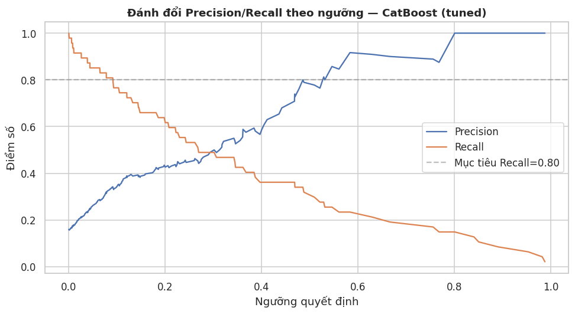
*Đường Recall cắt mục tiêu 0.80 nhiều lần khi ngưỡng dao động — lấy điểm **cuối cùng** thoả
điều kiện (chứ không phải điểm đầu tiên) mới cho ra ngưỡng dùng được (xem lỗi thật #2 bên
dưới).*

Ngưỡng cuối cùng: **0.0917** (làm tròn 0.092).

### 8. Explainable AI với SHAP

**Vì sao dùng `TreeExplainer` thay vì `KernelExplainer`:** `TreeExplainer` tính SHAP value
chính xác (không xấp xỉ) và nhanh hơn nhiều bậc cho các mô hình cây — nhưng cần một model cây
"thuần". Vì vậy classifier được tách riêng khỏi bước SMOTE trong Pipeline
(`pipeline.named_steps['clf']`) trước khi đưa vào `TreeExplainer`.

## Kết quả

| Mô hình | Ngưỡng | Precision | Recall | F1 | PR-AUC | ROC-AUC |
|---|---|---|---|---|---|---|
| Logistic Regression (baseline) | 0.50 | 0.56 | 0.49 | 0.52 | – | – |
| Logistic Regression (đã tune) | 0.50 | 0.356 | 0.681 | 0.467 | 0.568 | 0.786 |
| CatBoost (đã tune) | 0.50 | 0.778 | 0.298 | 0.431 | 0.572 | 0.801 |
| **CatBoost (đã tune) — MÔ HÌNH CUỐI** | **0.092** | **0.342** | **0.809** | **0.481** | **0.572** | **0.801** |

CatBoost thắng về PR-AUC/ROC-AUC (thước đo không phụ thuộc ngưỡng). Ở ngưỡng mặc định 0.5
nó có Precision rất cao nhưng Recall quá thấp (chỉ bắt được 30% người sắp nghỉ) — sau khi
hạ ngưỡng xuống 0.092 theo đúng yêu cầu kinh doanh, mô hình bắt được **81%** người sắp nghỉ
việc, đánh đổi bằng việc chấp nhận báo động nhầm nhiều hơn (Precision 34%).

Hai confusion matrix dưới đây là bằng chứng trực quan cho đúng câu chuyện bảng số liệu trên
kể — điểm khởi đầu và điểm kết thúc của cả dự án:

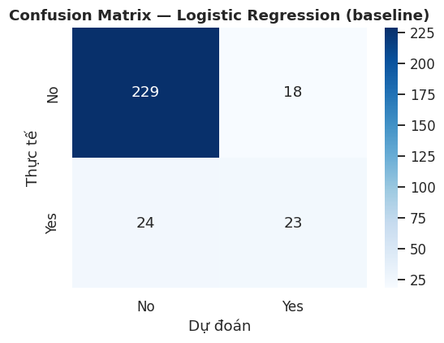
*Điểm khởi đầu — Logistic Regression, ngưỡng mặc định 0.5: bắt đúng 23/47 người sắp nghỉ, bỏ
sót 24, báo nhầm 18/247.*

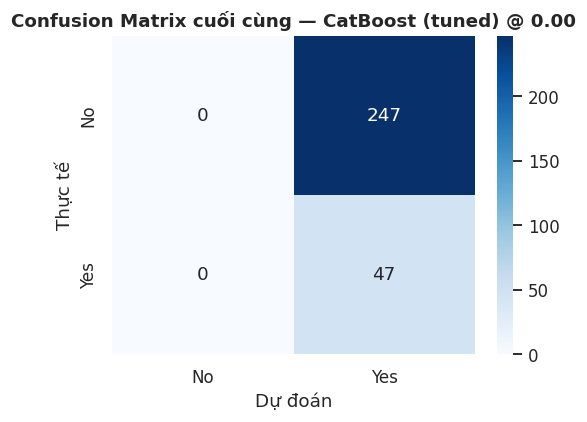
*Điểm kết thúc — CatBoost (tuned) tại ngưỡng 0.092: bắt đúng 38/47, bỏ sót chỉ còn 9, báo
nhầm tăng lên 73/247.*

**Đánh đổi rõ ràng, không giấu diếm:** từ bỏ sót hơn một nửa số người sắp nghỉ (24/47) xuống
chỉ còn bỏ sót 9/47 (19%) — đổi lại số báo động nhầm tăng từ 18 lên 73 người trên tổng 294
người trong tập test.

## Insight chính (SHAP)

`OverTime` (làm thêm giờ) là yếu tố ảnh hưởng mạnh nhất đến rủi ro nghỉ việc — bỏ xa các
yếu tố còn lại. Theo sau là `BusinessTravel` (đi công tác thường xuyên) và `StockOptionLevel`
thấp. Hai nhóm có rủi ro nội tại cao hơn hẳn: phòng **Sales** và vị trí **Laboratory
Technician**. Đáng chú ý: `MonthlyIncome` — dù tương quan thô khá cao — lại **không** nằm
trong top 10 yếu tố SHAP quan trọng nhất, cho thấy đãi ngộ tài chính không phải đòn bẩy
mạnh nhất; chính sách làm thêm giờ và cường độ công tác mới là nơi HR nên ưu tiên rà soát.


*OverTime_Yes (đỏ) dồn hẳn về phía SHAP dương — làm thêm giờ gần như luôn đẩy xác suất dự
đoán nghỉ việc lên cao, bất kể các yếu tố khác.*

Một ví dụ cụ thể — không chỉ nói chung chung mà nhìn vào đúng 1 nhân viên:

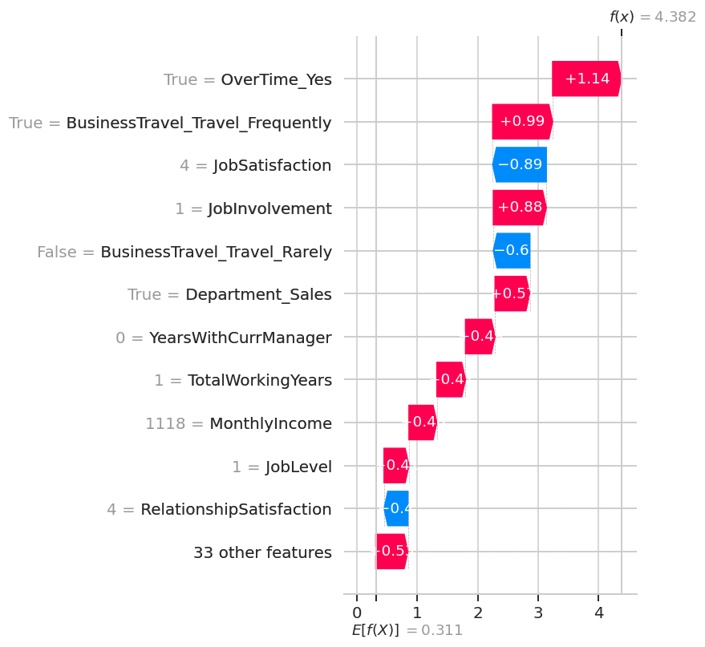
*Nhân viên này có OverTime=Yes, đi công tác thường xuyên, thuộc phòng Sales — 3 yếu tố này
cộng dồn đẩy điểm rủi ro dự đoán lên rất cao so với mức nền trung bình toàn dataset. Đây
chính là loại giải thích cấp-cá-nhân mà dashboard hiển thị cho từng nhân viên khi nhập tay.*

Sau khi hiểu các yếu tố rủi ro, toàn bộ 1.470 nhân sự được chấm điểm và phân khúc thành 3
nhóm hành động được ngay:

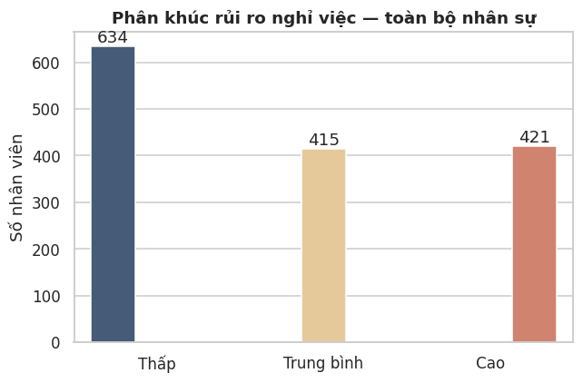
*634 người rủi ro Thấp, 415 người Trung bình, 421 người Cao.*

## Phân tích chuyên sâu

Ngoài quy trình 4 ngày chuẩn, có thêm 4 notebook (`05`–`08`) đào sâu vào những câu hỏi mà một
mô hình "chạy đúng số liệu" chưa tự trả lời được — không nằm trong phạm vi bắt buộc của lộ
trình gốc, nhưng là loại câu hỏi một stakeholder thực sự sẽ hỏi trước khi duyệt triển khai.

### Chi phí thực tính bằng tiền ($)

Bài toán gốc nói chi phí thay thế 1 nhân viên = 50–200% lương năm — nhưng chưa từng thực sự
tính ra con số $. Tối ưu chi phí không ràng buộc luôn đẩy ngưỡng về gần 0 (flag gần hết công
ty), vì trong giả định chi phí, mất 1 người luôn tốn hơn nhiều so với can thiệp ($300/người,
con số giả định — không phải đo được).

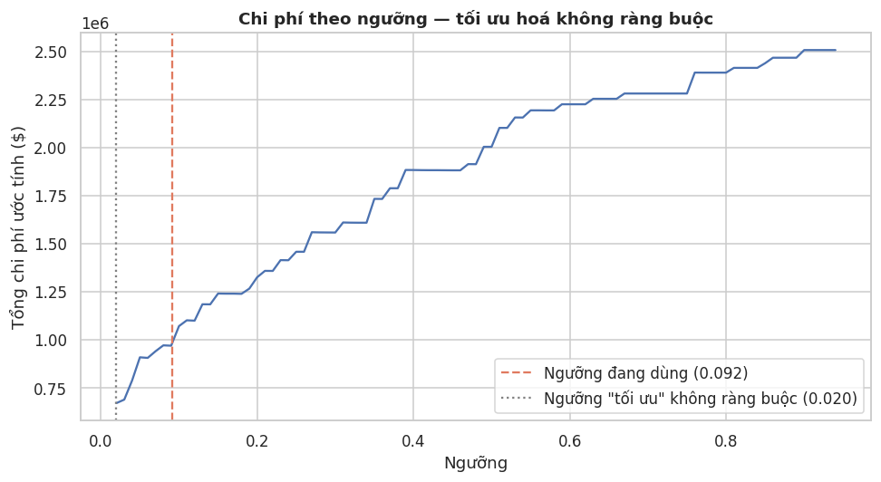
*Ngưỡng "tối ưu" không ràng buộc chỉ 0.020 — gần như flag toàn bộ công ty là rủi ro cao. Về
mặt toán học đúng theo giả định đưa vào, nhưng vô dụng trên thực tế vì HR không đủ năng lực
can thiệp cá nhân hoá hàng trăm người cùng lúc.*

Thêm ràng buộc theo năng lực HR (capacity) mới ra được khuyến nghị hành động được:

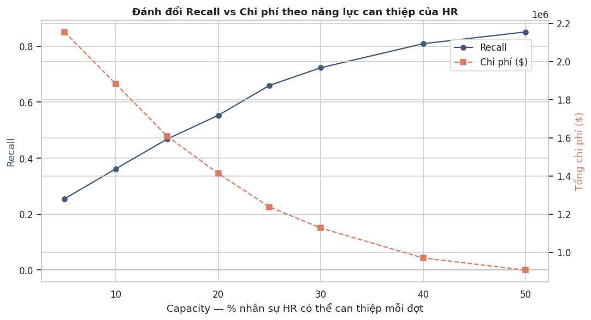
*Ở mức capacity ~15% (44 người trong tập test), Recall đạt được chỉ 0.468 — thấp hơn nhiều
mục tiêu 0.80 đặt ra ở bước Threshold Tuning. Ngưỡng đang dùng hiện tương đương ~37%
capacity, ước tính tiết kiệm hàng trăm nghìn $ so với không dùng model, trên quy mô tập test.*

Đây là câu hỏi **vận hành** cần trả lời cùng HR thật trước khi triển khai: HR có thực sự xử
lý được ngần đó người mỗi đợt không? Nếu không, cần hạ kỳ vọng Recall hoặc kéo dài chu kỳ
can thiệp.

### Mô hình bỏ sót ai

Test set có 47 người thực sự nghỉ việc — mô hình bắt đúng 38, bỏ sót 9. Ai là 9 người đó, và
họ khác gì với 38 người bắt đúng?

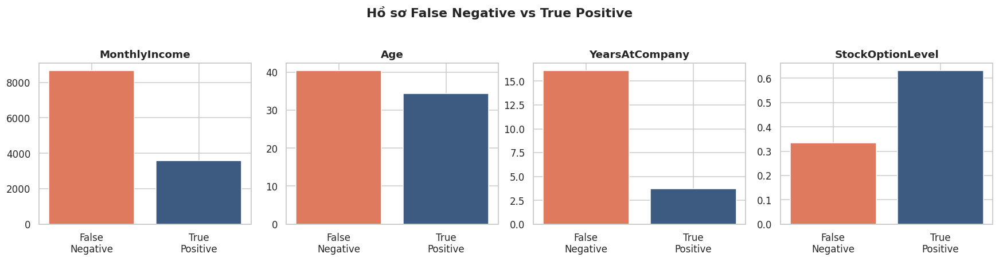
*Nhóm bị bỏ sót (False Negative) có thu nhập cao gấp ~2.4 lần, thâm niên gấp ~4.4 lần, lớn
tuổi hơn nhóm bắt đúng — và 0% trong số họ làm thêm giờ, so với 79% ở nhóm bắt đúng.*

**Đây là phát hiện quan trọng nhất của toàn bộ phân tích chuyên sâu:** mô hình học rất tốt
một kiểu nghỉ việc — "trẻ, mới vào, OT nhiều, lương thấp, dễ burnout" — vì đó là tín hiệu SHAP
mạnh nhất. Nhưng nó gần như **mù hoàn toàn** với một kiểu nghỉ việc khác: nhân sự **thâm
niên, thu nhập tốt, không hề làm thêm giờ** — âm thầm rời đi mà không có bất kỳ dấu hiệu
"burnout" cổ điển nào. Đây có thể là nghỉ hưu sớm, bị công ty khác săn đón, hoặc thay đổi
định hướng sự nghiệp — những động cơ mà dữ liệu hiện tại không có biến nào đo trực tiếp
được. Đây là giới hạn thật của mô hình, không phải điều có thể sửa bằng cách tune thêm — cần
thêm dữ liệu mới (khảo sát gắn kết, tín hiệu thị trường lao động) mới thu hẹp được.

### Các biến tương tác với nhau ra sao

Beeswarm ở phần Insight cho thấy ảnh hưởng *trung bình* của từng biến — nhưng ảnh hưởng thực
tế của 1 biến thường phụ thuộc vào giá trị của 1 biến khác đi kèm.

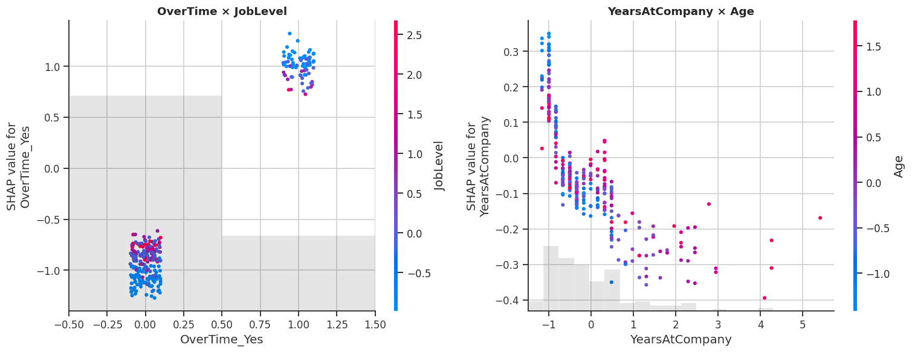
*Hai cặp tương tác mạnh nhất theo SHAP: `OverTime` × `JobLevel` (trái) và `YearsAtCompany` ×
`Age` (phải).*

### Mô hình có công bằng không

Một mô hình quyết định "ai bị HR chú ý" cần được kiểm tra xem có thiên vị theo nhóm nhân
khẩu học hay không — kể cả khi các biến này (Gender, Age, MaritalStatus) không được đưa trực
tiếp vào model để train. Cỡ mẫu ở đây khá nhỏ (test set chỉ 294 người, có nhóm chỉ 4-9 người
thực sự nghỉ việc) — số liệu dưới đây mang tính **chỉ báo cần theo dõi thêm**, chưa đủ mạnh
để kết luận chắc chắn theo nghĩa thống kê.

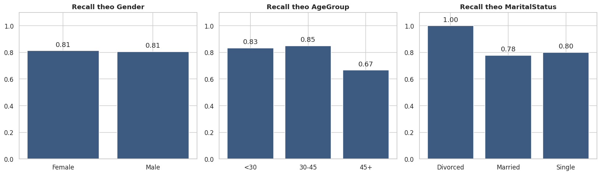
*Giới tính: Recall gần như ngang nhau (Nữ 0.81 vs Nam 0.81), Disparate Impact Ratio = 0.899
— đạt quy tắc 4/5. Nhóm tuổi 45+ là chỗ đáng chú ý nhất: Recall chỉ 0.667, thấp hơn hẳn nhóm
dưới 30 (0.833) và 30-45 (0.850) — khớp hoàn toàn với phát hiện False Negative ở trên, dù cỡ
mẫu nhóm 45+ chỉ có 9 người.*

Nhóm Độc thân bị gắn cờ nhiều hơn hẳn (55.7% vs ~27-30% các nhóm khác) — nhưng phần lớn phản
ánh đúng tỷ lệ nghỉ việc thật sự khác nhau giữa các nhóm (Độc thân 25/97 ≈ 25.8% thực sự
nghỉ, Đã kết hôn 18/133 ≈ 13.5%) chứ không hẳn là thiên vị vô căn cứ — dù vậy đây vẫn là điểm
nên trao đổi rõ với HR trước khi triển khai.

### Driver có khác nhau giữa các phòng ban không

Bất ngờ (theo hướng tích cực): top 3 yếu tố quan trọng nhất — `OverTime`, `BusinessTravel`,
`StockOptionLevel` — **giống hệt nhau** ở cả 3 phòng ban (Sales, R&D, HR), chỉ khác nhẹ ở
yếu tố thứ 4-5. Nghĩa là HR **không cần thiết kế chính sách giữ chân riêng biệt cho từng
phòng ban** — chính sách rà soát OT và tần suất công tác áp dụng company-wide sẽ tác động
đến phần lớn rủi ro, dù phòng ban nào cũng vậy. (Nhóm HR chỉ có 15 người trong tập test nên
kết quả riêng phòng này kém tin cậy hơn 2 phòng còn lại.)

### 4 chân dung người nghỉ việc

SHAP và phân tích False Negative ở trên đều chỉ ra **một** driver chủ đạo (OverTime) và
**một** nhóm bị bỏ sót (thâm niên). Nhưng liệu người nghỉ việc có thực sự chỉ có 1-2 kiểu?
Phân cụm K-Means trên toàn bộ 237 người đã nghỉ (không chỉ 47 người ở tập test) để có mẫu đủ
lớn. Silhouette cao nhất chỉ 0.25 (ở K=2) — dữ liệu hành vi con người hiếm khi tạo cụm tách
bạch rõ ràng như dữ liệu kỹ thuật, nên đây là phân nhóm **mềm**, mang tính gợi ý xu hướng chứ
không phải ranh giới cứng.

**Vì sao chọn K=4 dù silhouette thấp hơn K=2:** K=2 về cơ bản chỉ tách "OT hay không" — đúng
nhưng không có gì mới so với những gì SHAP đã cho biết. K=4 cho ra 4 chân dung dễ diễn giải
và hành động hơn hẳn, dù đánh đổi bằng silhouette thấp hơn.

| Cụm | Tên gợi ý | n | Đặc điểm nổi bật |
|---|---|---|---|
| C3 | Nhà nghiên cứu trẻ kiệt sức | 90 | Trẻ nhất (28.3 tuổi), lương thấp nhất, OT 67%, chủ yếu Lab Technician/Research Scientist |
| C0 | Nhân viên hay nhảy việc | 76 | Từng làm nhiều công ty nhất (4.4), nhà xa nhất (13.4km), tuổi trung niên |
| C1 | Chiến binh công tác | 54 | 100% đi công tác thường xuyên, trẻ, lương thấp |
| C2 | Rời đi trong âm thầm | 17 | Lớn tuổi nhất (46.9), lương cao nhất ($13.663 — gấp 4.8 lần C3), thâm niên 20.5 năm |

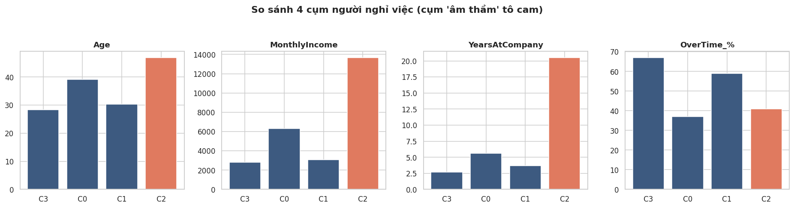
*Cụm "Rời đi trong âm thầm" (C2, cam) vượt hẳn 3 cụm còn lại về tuổi, thu nhập và thâm niên
— nhưng lại có tỷ lệ OT thấp nhất trong 4 cụm.*

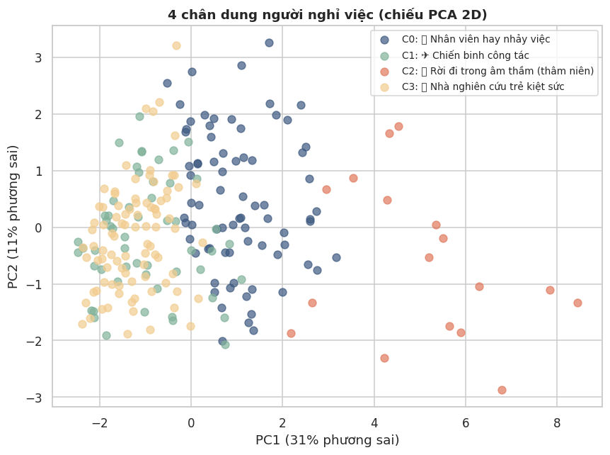
*C2 (đỏ) tách khá rõ khỏi 3 cụm còn lại trên trục PC1.*

Cụm C2 **trùng khớp với chính xác nhóm False Negative** đã phát hiện ở trên — nhưng lần này
được xác nhận độc lập trên **toàn bộ 237** người đã nghỉ, bằng phương pháp hoàn toàn khác
(unsupervised clustering thay vì phân tích lỗi có giám sát). Hai phương pháp độc lập ra cùng
kết luận là tín hiệu đáng tin hơn nhiều so với chỉ 1 phân tích đơn lẻ.

**Ý nghĩa hành động:** 4 chân dung cần 4 chiến lược giữ chân khác nhau — C3 cần giảm tải OT;
C1 cần giảm tần suất công tác hoặc phụ cấp tương xứng; C0 cần tìm hiểu vì sao họ "không trung
thành" (lương? cơ hội thăng tiến?); C2 cần một cuộc trò chuyện hoàn toàn khác — về định hướng
sự nghiệp dài hạn, không phải về khối lượng công việc.

### ML có thực sự đáng công sức bỏ ra không

So với luật đơn giản 1 dòng code: *"cứ ai đang làm thêm giờ thì liên hệ."*

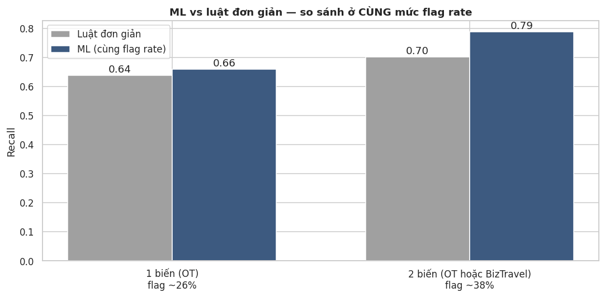
*So ở CÙNG mức flag rate. Luật 1 biến (OT, flag ~26%): Recall 0.64 vs ML 0.66 (+2 điểm %).
Luật 2 biến (OT hoặc đi công tác thường xuyên, flag ~38%): Recall 0.70 vs ML 0.79 (~9 điểm
%) — khoảng cách nới rộng khi luật thêm biến.*

**Câu trả lời trung thực: không nhiều, ở mức flag rate thấp.** Giá trị thật của ML không nằm
ở quyết định nhị phân "liên hệ hay không" — một luật vài dòng code đã làm khá tốt việc đó.
Giá trị thật nằm ở 3 chỗ luật đơn giản không làm được:
1. **Xếp hạng liên tục** (risk score 0-100%) thay vì chỉ nhị phân — cho phép phân bổ nguồn
   lực HR theo capacity thực tế, luật đơn giản không xếp hạng được.
2. **Kết hợp hàng chục tín hiệu yếu** cùng lúc (44 biến) thay vì chỉ 1-2 biến mạnh nhất.
3. **Giải thích được** (SHAP) — biết *vì sao* một người cụ thể rủi ro cao, luật if-else
   không tự nhiên trả lời được câu đó cho từng cá nhân.

Đây là kết luận quan trọng cần nói thẳng với stakeholder: **đừng bán ML như một phép màu thay
thế trực giác của HR** — với dataset này, trực giác "để ý ai đang làm thêm giờ" đã đúng phần
lớn. Bán đúng giá trị: độ chi tiết, khả năng mở rộng, và khả năng giải thích.

### Vách đá năm 1 — khi nào người ta nghỉ việc

Toàn bộ phân tích trước (SHAP, cost-benefit, persona) trả lời **AI** có nguy cơ cao. Câu hỏi
ở đây khác hẳn: **THỜI ĐIỂM** nào trong vòng đời một nhân viên là rủi ro nhất? Đây là một kỹ
thuật thống kê khác hoàn toàn — Survival Analysis (Kaplan-Meier + Cox Proportional Hazards,
vốn dùng trong y khoa để đo thời gian đến 1 sự kiện) — áp dụng vào HR: thời gian đến khi
nghỉ việc. Giới hạn cần biết trước: dữ liệu là 1 lát cắt tại 1 thời điểm (cross-sectional),
người chưa nghỉ được xem là "censored" tại đúng số năm hiện tại của họ — cách làm chuẩn
trong survival analysis, nhưng không thay thế được dữ liệu theo dõi thật nếu có.

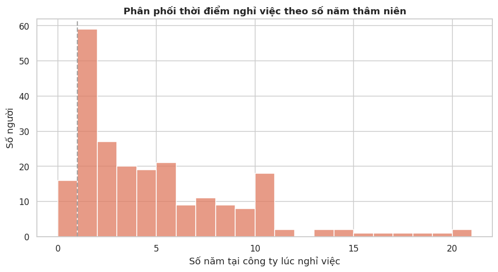
*31.6% của TẤT CẢ người từng nghỉ việc rời đi ngay trong năm đầu tiên — gần 1/3. Đường đứt
nét đánh dấu mốc 1 năm.*

Đây là phát hiện có thể hành động ngay: onboarding và 12 tháng đầu là giai đoạn rủi ro cao
nhất theo đúng nghĩa đen, không phải cảm tính. Chính sách giữ chân nên tập trung nguồn lực
vào mốc check-in tháng thứ 6, 9, 12 thay vì rải đều cho mọi thâm niên.

SHAP cho biết mức đóng góp vào 1 dự đoán cụ thể. Cox model cho một con số khác, dễ nói
chuyện với sếp hơn: **"người có đặc điểm X rời đi nhanh gấp bao nhiêu lần"**, kiểm soát đồng
thời tất cả biến khác.

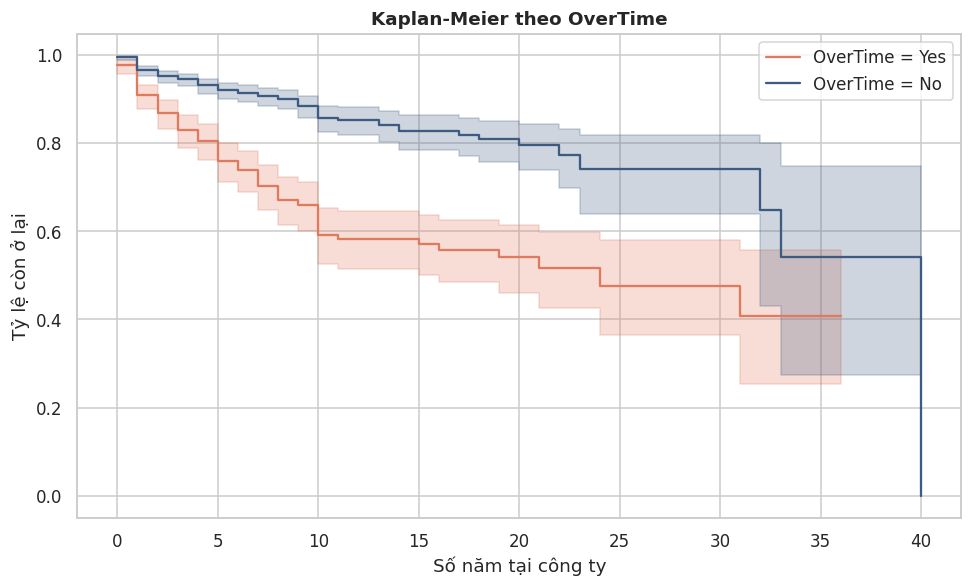
*Đường sống còn của nhóm OT tụt nhanh hơn rõ rệt ngay từ những năm đầu.*

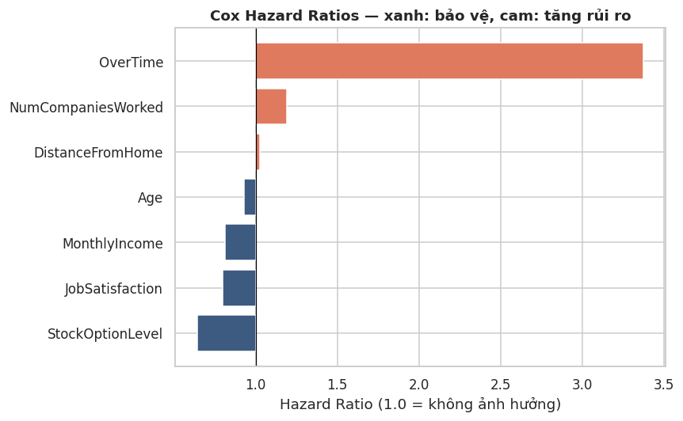
*Kiểm soát đồng thời mọi biến khác — cam là tăng rủi ro, xanh là bảo vệ.*

**Đọc thành câu nói được ngay với stakeholder:**
- Nhân viên làm thêm giờ rời đi nhanh gấp **3.37 lần** người không làm thêm giờ (p<0.001)
- Mỗi công ty từng làm thêm trong lý lịch tăng tốc độ rời đi thêm **19%**
- Mỗi mức StockOptionLevel tăng thêm giảm tốc độ rời đi **36%**
- Mỗi $1.000 lương tháng tăng thêm giảm tốc độ rời đi **19%**
- Mỗi điểm JobSatisfaction (thang 1-4) tăng thêm giảm tốc độ rời đi **20%**

C-index = 0.837 — mô hình sống còn này phân biệt "ai rời sớm hơn ai" khá tốt. OverTime không
chỉ tăng *khả năng* nghỉ việc (SHAP) mà còn tăng *tốc độ* nghỉ việc gấp 3.37 lần (Cox) — hai
kỹ thuật khác nhau, cùng chỉ về một biến, theo hai cách diễn giải bổ trợ nhau. Cách nói "gấp
3.37 lần" dễ đưa vào slide thuyết trình hơn nhiều so với SHAP value hay xác suất thô.

## Dashboard demo

Dự án có **2 phiên bản dashboard** (cùng logic, khác nền tảng) để demo:

| | Streamlit | Gradio |
|---|---|---|
| File | `app/app.py` | `app/gradio_app.py` |
| Chạy local | `streamlit run app/app.py` | `python app/gradio_app.py` |
| Deploy free | Streamlit Community Cloud | Hugging Face Spaces |
| Phù hợp khi | dashboard nội bộ, nhiều panel | demo model chia sẻ nhanh, hệ sinh thái AI/HuggingFace |

Cả 2 đều có **3 chế độ**:
- **Tải CSV hàng loạt** (định dạng gốc như file Kaggle) → chấm điểm rủi ro toàn bộ danh sách
- **Nhập tay 1 nhân viên** → dự đoán tức thì + giải thích SHAP + **tóm tắt tự động** (ghép
  từ SHAP + phát hiện Cox/survival analysis, hoàn toàn rule-based — không gọi API trả phí)
  + **what-if simulator**: thử đổi OverTime/StockOptionLevel/BusinessTravel và xem rủi ro
  thay đổi ngay lập tức
- **Top rủi ro cao nhất**: chấm điểm toàn bộ nhân sự hiện có (không cần upload), xếp hạng
  Top N kèm lý do chính (SHAP) — sẵn sàng dùng để triage ngay, không cần chuẩn bị dữ liệu gì thêm

### Deploy Gradio lên Hugging Face Spaces (free)

1. Tạo tài khoản tại huggingface.co → **New Space** → chọn SDK = **Gradio**
2. Trong Space mới, tải lên: `app/gradio_app.py` (đổi tên thành `app.py`), toàn bộ thư mục
   `models/`, và `requirements.txt`
3. Sửa dòng cuối `gradio_app.py` nếu cần: Spaces tự chạy file `app.py`, không cần gọi `demo.launch()`
   thủ công (Spaces tự nhận biến `demo`)
4. Space build xong sẽ có link dạng `https://huggingface.co/spaces/<username>/<space-name>` — dán vào đầu README

## Cách chạy dự án

```bash
git clone https://github.com/<username>/employee-attrition-prediction.git
cd employee-attrition-prediction
pip install -r requirements.txt

# Mở các notebook theo thứ tự 01 -> 04 (thư mục notebooks/), hoặc chạy thẳng dashboard:
streamlit run app/app.py        # bản Streamlit
python app/gradio_app.py        # bản Gradio (http://localhost:7860)
```

## Cấu trúc thư mục

```
employee-attrition-prediction/
├── data/
│   ├── raw/                          # dataset gốc từ Kaggle
│   └── processed/                    # dữ liệu đã encode, kết quả so sánh mô hình, risk segmentation
├── notebooks/
│   ├── 01_eda_preprocessing.ipynb
│   ├── 02_split_smote_baseline.ipynb
│   ├── 03_tuning_evaluation_threshold.ipynb
│   ├── 04_shap_explainability.ipynb
│   ├── 05_deep_dive_insights.ipynb   # cost-benefit, error analysis, fairness audit
│   ├── 06_personas_and_baseline.ipynb # persona clustering, ML vs luật đơn giản
│   ├── 07_survival_analysis.ipynb    # Kaplan-Meier, Cox hazard ratios ("vách đá năm 1")
│   └── 08_calibration_check.ipynb    # kiểm chứng (và bác bỏ) giả thuyết về calibration
├── models/                           # scaler, model cuối, threshold, schema cho app
├── images/                           # 26 biểu đồ — phần lớn được nhúng trực tiếp trong README này
├── app/
│   ├── app.py                        # Streamlit dashboard
│   └── gradio_app.py                 # Gradio dashboard (deploy free lên HuggingFace Spaces)
├── requirements.txt
└── README.md
```

## Lỗi thật gặp phải trong lúc làm

Không phải mọi thứ đúng ngay từ lần chạy đầu — 3 lỗi dưới đây là thật, bắt được khi số liệu
trông "đẹp bất thường" hoặc sai rõ ràng, không phải liệt kê cho có. Chi tiết trước/sau nằm
trong git log (`git log --oneline`) và trong chính các notebook, tại đúng chỗ lỗi xảy ra.

1. **SMOTE rò rỉ qua các fold Cross-Validation** (Ngày 2) — so sánh nhanh 5 mô hình bằng
   cách đưa thẳng dữ liệu đã SMOTE vào `cross_validate()`. Recall/Precision/PR-AUC của
   *mọi* mô hình đều ra 90-98%, cao hơn baseline (~50%) một cách vô lý. Nguyên nhân: một
   điểm tổng hợp ở fold validation có thể được nội suy từ điểm gốc đang nằm ở fold train
   của chính vòng đó. Sửa bằng `imblearn.Pipeline` để SMOTE chạy lại trong từng fold — số
   liệu rơi về mức thực tế hơn (Recall 34-49%).
2. **Logic tìm threshold bị đảo ngược** (Ngày 3) — dùng `np.argmax(recalls >= 0.80)` để
   tìm ngưỡng đạt Recall≥0.80, nhưng `argmax` trả về vị trí *đầu tiên* thoả điều kiện, trong
   khi recall giảm dần theo threshold tăng → chọn nhầm ngưỡng ≈0.001, model gắn cờ gần hết
   mọi người là rủi ro cao (Recall=1.0 nhưng Precision=0.16, vô dụng). Sửa bằng cách lấy vị
   trí *cuối cùng* thoả điều kiện thay vì đầu tiên.
3. **`pd.get_dummies(drop_first=True)` vỡ khi encode 1 dòng dữ liệu** (Ngày 4, lúc build
   dashboard) — hàm tiền xử lý cho form nhập tay gọi `get_dummies` trực tiếp trên 1 dòng,
   nhưng với 1 dòng thì mỗi cột categorical chỉ có 1 giá trị, nên `drop_first` xoá luôn giá
   trị đó bất kể nó có phải category tham chiếu lúc train hay không. Cùng 1 nhân viên, xác
   suất đúng là 91.5% nhưng hàm lỗi cho ra 4.1%. Sửa bằng cách encode thủ công theo đúng
   schema cột đã lưu, verify lại khớp 100% trên toàn bộ 1470 dòng lẫn từng dòng đơn lẻ.

## Cải thiện thêm

- **Hiệu chỉnh xác suất (calibration):** ban đầu lo ngại threshold cuối cùng chỉ 0.092 là
  dấu hiệu model bị lệch xác suất — đã kiểm tra lại giả thuyết này ở
  `08_calibration_check.ipynb` và kết quả cho thấy **không phải vậy**. Áp dụng Platt scaling
  (`CalibratedClassifierCV`) gần như không đổi threshold (0.092 → 0.094), Brier score
  (0.1002 → 0.0984), hay ROC-AUC/PR-AUC.

  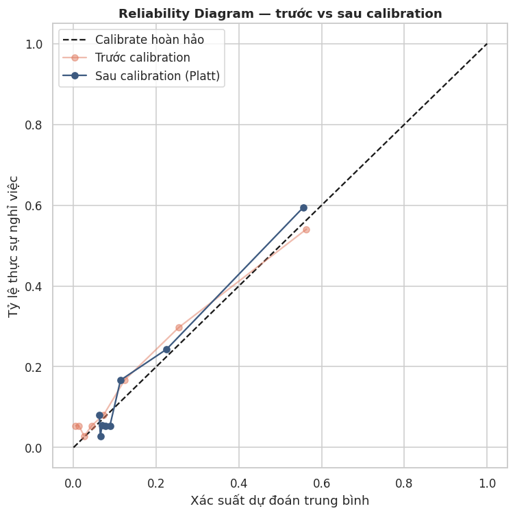
  *Cả trước và sau khi calibrate lại bằng Platt scaling, đường cong đều bám khá sát đường
  chéo lý tưởng — xác suất dự đoán vốn đã tương đối đáng tin, không lệch hệ thống lớn.*

  Model đã calibrate tương đối tốt từ đầu — threshold thấp là hệ quả toán học tất yếu của
  việc yêu cầu Recall≥0.80 trên bài toán có base rate chỉ 16%, không phải lỗi model. Chi
  tiết đầy đủ nằm trong `08_calibration_check.ipynb`.

## Tech Stack

Python · pandas · scikit-learn · imbalanced-learn · CatBoost/XGBoost/LightGBM · SHAP ·
lifelines · Streamlit · Gradio

## Tác giả

Minh Quý
